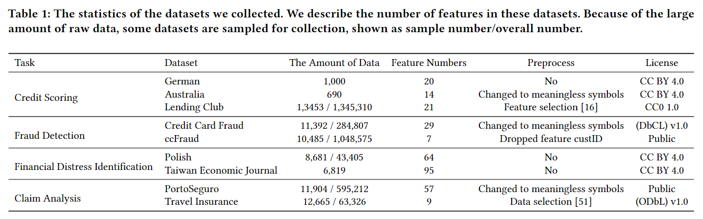
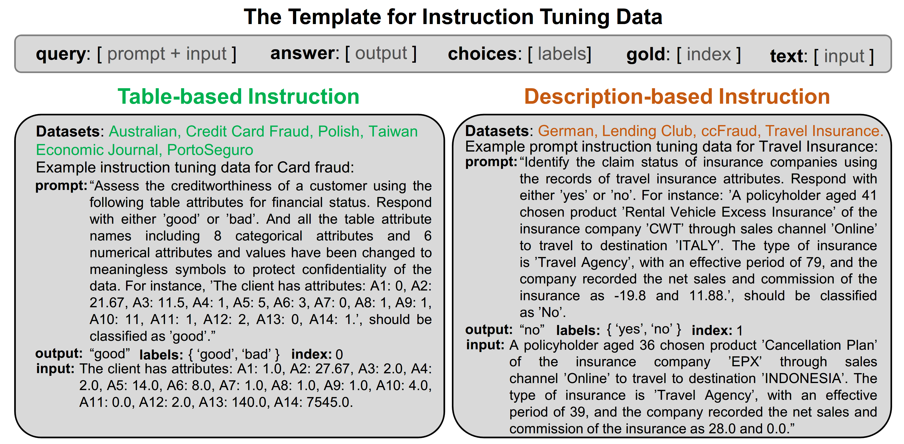
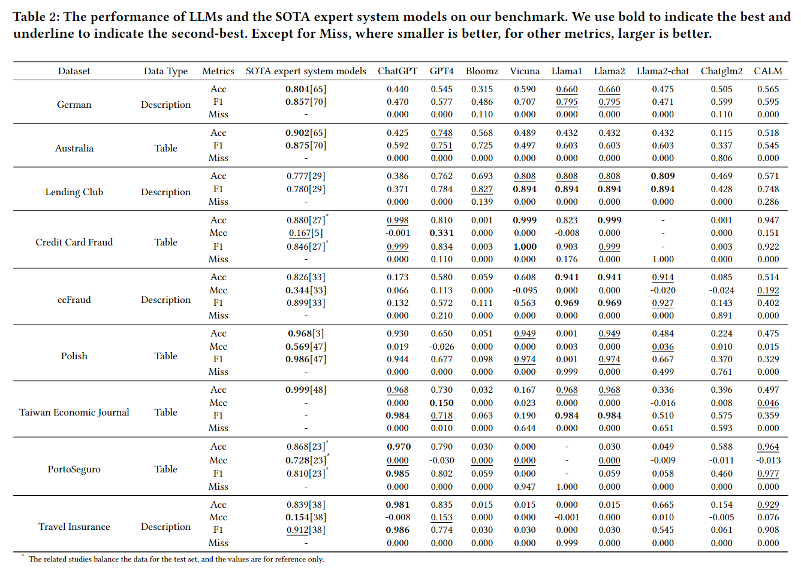
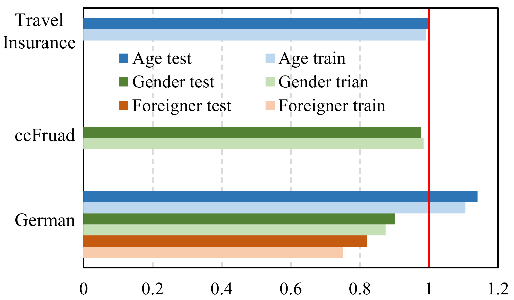
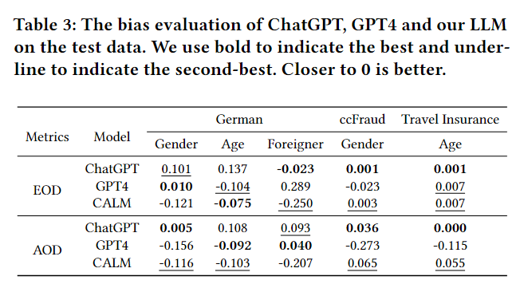

# Empowering Many, Biasing a Few: Generalist Credit Scoring through Large Language Models

<div>
<div align="left">
    <a target='_blank'>Duanyu Feng<sup>1</sup></span>&emsp;
    <a target='_blank'>Yongfu Dai<sup>1</sup></span>&emsp;
    <a href='https://jimin.chancefocus.com/' target='_blank'>Jimin Huang<sup>2</sup></a>&emsp;
    <a target='_blank'>Yifang Zhang<sup>1</sup></a>&emsp;
    <a target='_blank'>Qianqian Xie<sup>3</sup></a>&emsp;
    <a target='_blank'>Weiguang Han<sup>3</sup></a>&emsp;
    <a href='https://warrington.ufl.edu/directory/person/12693/' target='_blank'>Alejandro Lopez-Lira<sup>4</sup></a>&emsp;
    <a target='_blank'>Hao Wang*<sup>1</sup></a>
</div>
<div>
<div align="left">
    <sup>1</sup>Sichuan University&emsp;
    <sup>2</sup>ChanceFocus AMC&emsp;
    <sup>3</sup>Wuhan University&emsp;
    <sup>4</sup>University of Florida
</div>
<div align="left">
    &emsp;
    &emsp;
    &emsp;
     
</div>


Our project **CALM** aims to better utilize large language models (LLMs) to study issues related to credit and risk assessment in the financial industry, including data construction, model training, model evaluation, and bias analysis. 

We will open the following parts in this project:
* [Credit and Risk Assessment Instruction Dataset](./data)
* [Credit and Risk Assessment Benchmark](#credit-and-risk-assessment-benchmark)
* [Credit and Risk Assessment LLM Bias Analysis](./src/bias)
* **C**redit and Risk **A**ssessment **L**arge Language **M**odel (CALM 7B, COMING SOON)
* [Our Paper "Empowering Many, Biasing a Few: Generalist Credit Scoring through Large Language Models"](https://arxiv.org/abs/2310.00566)

## News

**[2023/10/01]** CALM v1.0 has been officially released, open-sourcing the [Instruction Dataset](./data), [Benchmark](#credit-and-risk-assessment-benchmark), [Bias Analysis](./src/bias) and [paper](https://arxiv.org/abs/2310.00566).

## Contents

- [Introduction](#introduction)
- [Credit and Risk Assessment Instruction Dataset](#credit-and-risk-assessment-instruction-dataset)
- [Fine-tuning and Inference](#fine-tuning-and-inference)
- [Credit and Risk Assessment Benchmark](#credit-and-risk-assessment-benchmark)
- [Bias Analysis](#bias-analysis)
- [Acknowledgements](#acknowledgements)
- [Disclaimer](#disclaimer)
- [Citation](#citation)
- [License](#license)

## Introduction
Credit and risk assessment is a series of unique tasks in the financial industry, which play a significant role in various aspects of individuals and society . It evaluates the creditworthiness and risk situation of individuals, businesses, and even countries. The assessment includes tasks such as credit scoring, fraud detection, financial distress identification, and claim analysis. These tasks cover most aspects of our personal lives and social development, such as lending, insurance, and investment, which have a huge financial impact for the whole of society. Meanwhile, it is essential to note that data used for credit and risk assessment may collect some sensitive information such as gender and age. This may further lead to discrimination against certain groups. Therefore, in credit and risk assessment, the potential biases should be aware of to avoid negative social consequences.

Currently, LLMs' potential in financial natural language processing (NLP) tasks is significantly emphasized. Some studies explore the ability of the LLMs to improve quantitative stock trading strategies, predict stock market returns, and analyze investment context. This further raises the question of whether LLMs will have sufficient capabilities if used for credit and risk assessment or if it may bring some bias. 

We constructed the first comprehensive **benchmark** and **instruction datasets** with 70K data samples. We amalgamated an extensive array of 9 existing public datasets on 4 tasks, including credit scoring, fraud detection, financial distress identification, and claim analysis. It includes data that is meaningless, imbalanced, and high-dimensional. 

We fine-tune our Credit and Risk Assessment LLM (**CALM**) based on Llama2-chat with the instructions.

We also identify the inherent **biases** within the models.

## Credit and Risk Assessment Instruction Dataset
### Data Collection
In the data collection, we provide a comprehensive overview of the tasks related to credit and risk assessment, and gather nine well-known open-source datasets with detailed introductions. 

we classify it into four classes of tasks: credit scoring, fraud detection, financial distress identification, and claim analysis. All of them are binary classification problems and tabular-based.
We finally collect nine datasets for these tasks, including three credit scoring datasets, two fraud detection datasets, two financial distress identification datasets, and two claim analysis datasets. 
Among them, three original datasets (Australia, Credit Card Fraud, PortoSeguro) have been processed into meaningless symbols. 
For those datasets with a large amount, we sample them based on the label distribution for our data collection.
All of these original datasets are open-source and have been widely used and validated by the existing works.



### Data Construction
In the data construction, we detail how we construct various instruction-tuning forms tailored to different datasets.

<div align="center">  </div>

Due to the unique nature of some datasets (many features or meaning-
less symbols), we create two different forms of instructions table-based and description-based, to evaluate the LLMs. 
Both forms of instruction first follow a similar template. For instance, [prompt] is a prompt created for each data, [input] expresses a single data from the original datasets, [output] is the corresponding correct label for the [input], [choices] are the available label options (such as ["Yes", "No"] or ["good", "bad"]), and [index] is the index of the correct label in the label set. Therefore, the differences between the two instructions come from the specific construction of [prompt] and [input].

**Table-based Instruction.**
This form of instruction is designed for data that contains too many features or meaningless symbols. As their features are too many or do not have any semantic information, it is hard to describe them in natural language with limited words. Therefore, in the [prompt], we explain the data is composed of meaningless symbols and provide the number of features; in the [input] section, we directly tell the values of each data.
It is concise and convenient to construct for highly structured data. 


**Description-based Instruction.**
This form of instruction is designed for the rest datasets that have clear semantic information about the features.
Here, we use natural language in [input] to re-explain the meaning of features and the corresponding numerical values for each data. For instance, in credit scoring, we transfer the features as ``The purpose is car (new). The state of credit amount is 2366." This form makes LLMs easier to understand the data.

## Fine-tuning and Inference
The code is being collated

## Credit and Risk Assessment Benchmark
We choose the latest and most popular LLMs as the baselines, including open resources and non-open resources. For the open resource LLMs, we use 6 LLMs, Bloomz, Vicuna, Llama1, Llama2, Llama2-chat, and Chatglm2. To ensure fairness and minimize computation costs, we use the around 7B-parameters version for all these LLMs. For the non-open resource LLMs, we use ChatGPT and GPT-4. In addition, We have also included a comparison of the results from the SOTA expert system models on various datasets.

### Evaluation Data
Credit Scoring 
- [German](https://huggingface.co/datasets/daishen/cra-german)
- [Australia](https://huggingface.co/datasets/daishen/cra-australian)
- [Lending Club](https://huggingface.co/datasets/daishen/cra-lendingclub)
  
Fraud Detection 
- [Credit Card Fraud](https://huggingface.co/datasets/daishen/cra-ccf)
- [ccFraud](https://huggingface.co/datasets/daishen/cra-ccfraud)

Financial Distress Identification 
- [Polish](https://huggingface.co/datasets/daishen/cra-ccfraud)
- [Taiwan Economic Journal](https://huggingface.co/datasets/daishen/cra-taiwan)

Claim Analysis
- [PortoSeguro](https://huggingface.co/datasets/daishen/cra-portoseguro)
- [Travel Insurance](https://huggingface.co/datasets/daishen/cra-travelinsurace)


### Evaluation Results


## Bias Analysis
We explore bias in three datasets using three LLMs (ChatGPT, GPT-4, and our model) that have the processing ability of the tasks. We consider the impact of gender, age, and foreign status on German, the impact of gender on ccFraud, and the impact of age on Travel Insurance. We set the old, female and foreigner as the unprivileged groups for gender, age, and foreign status, respectively. Except for the 'foreigner' in German, the DI values are near 1, indicating that the original datasets are unbiased on these sensitive features.

<div align="center">  </div>

After the prediction of the LLMs,  we compute the EOD and AOD on these features. 
For ChatGPT and GPT-4, it indicates that they have a bias in some special cases. For example, GPT-4 is more likely to give females wrong predictions (AOD is -0.273) on the ccFraud dataset and prefer foreign workers on the German dataset (EOD is 0.289), even though the original data is unbiased (DI close to 1); on the German dataset, ChatGPT prefers to lend money to older people (EOD is 0.137). It's also interesting to note that the potential biases that exist in both ChatGPT and GPT-4 are not completely consistent with each other ('gender' and 'age' in German, and 'gender' in ccFraud). 

<div align="center">  </div>


## Acknowledgements
This project is built upon the following open-source projects, and we are really thankful for them:

- [**Llama 2**](https://github.com/facebookresearch/llama)
- [**PIXIU**](https://github.com/chancefocus/PIXIU)
- [**LLMindCraft**](https://github.com/XplainMind/LLMindCraft)

## Disclaimer
This project is provided for **academic and educational purposes** only. We do not take responsibility for any issues, risks, or adverse consequences that may arise from the use of this project.

## Citation
If our project has been helpful for your work, please cite as follows:
```
@misc{feng2023empowering,
      title={Empowering Many, Biasing a Few: Generalist Credit Scoring through Large Language Models}, 
      author={Duanyu Feng and Yongfu Dai and Jimin Huang and Yifang Zhang and Qianqian Xie and Weiguang Han and Alejandro Lopez-Lira and Hao Wang},
      year={2023},
      eprint={2310.00566},
      archivePrefix={arXiv},
      primaryClass={cs.LG}
}
```

## License
CALM is licensed under [MIT]. For more details, please see the [MIT](./LICENSE) file.
